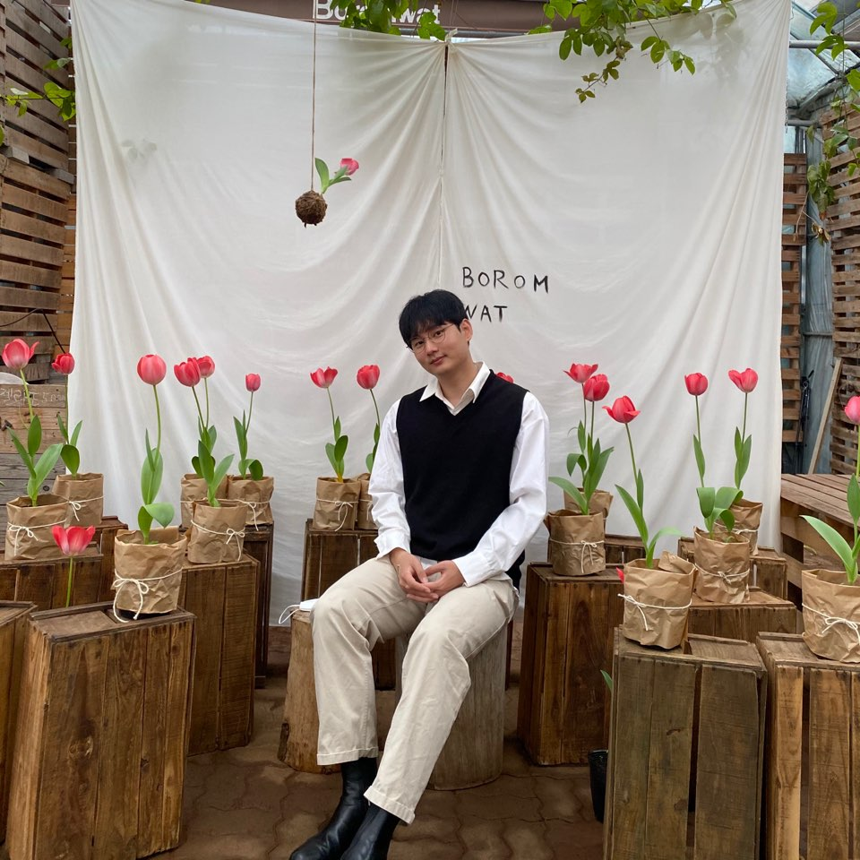
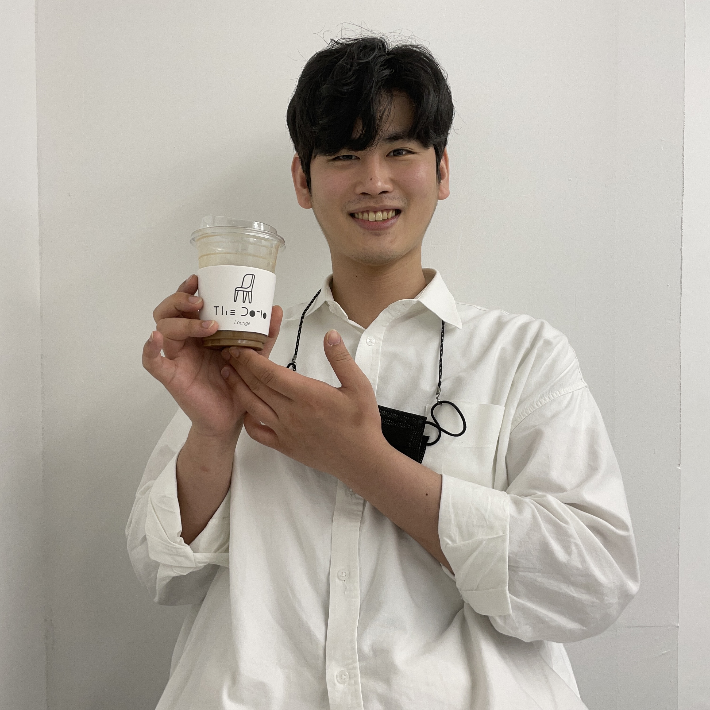
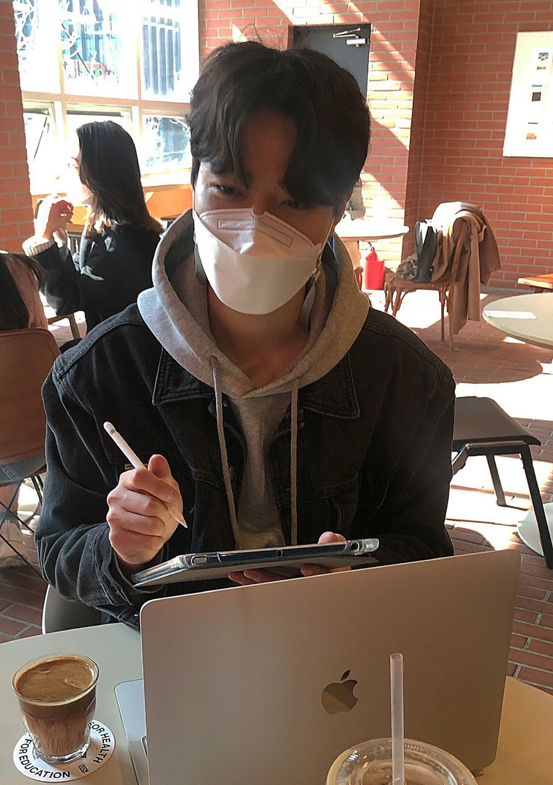
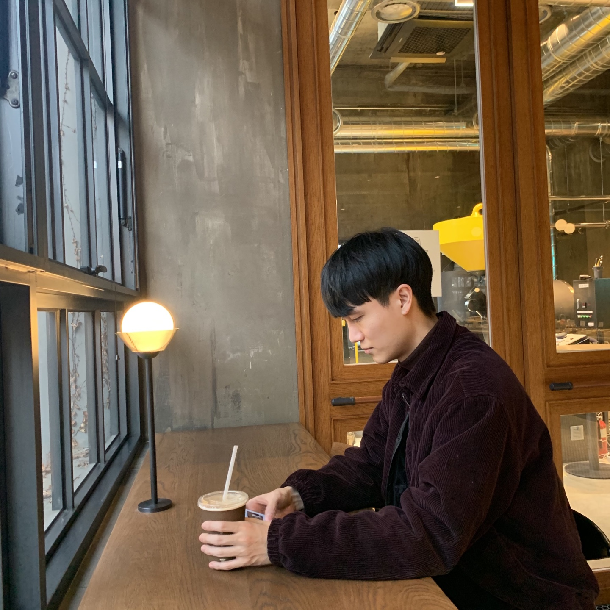
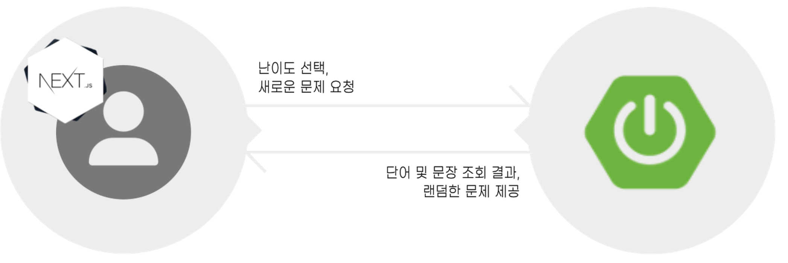
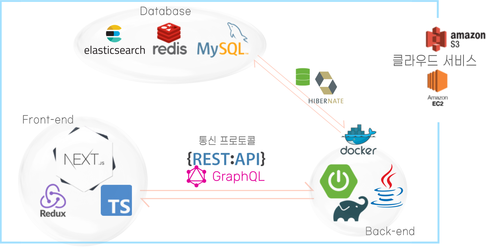
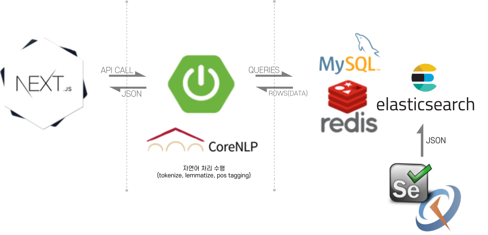
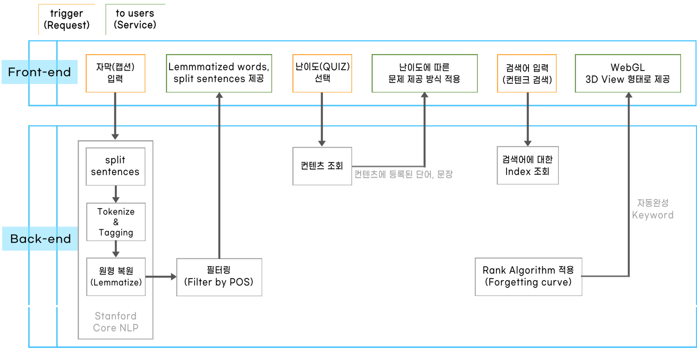

<h2 align="center">HIING</h2>

<p align="center">
  <a href="http://www.hiing.ml/" rel="noopener">
 </a>
</p>


<div align="center">

  []()
  [](https://github.com/kookmin-sw/capstone-2021-2/issues)
  [](https://github.com/kookmin-sw/capstone-2021-2/pulls)
  [](/LICENSE)

</div>

---

<p align="center"> Capstone - 2021
    <br> 
    🤖 조영훈, 전범수, 이헌재, 김동욱, 강신표 🤖
</p>

## 📝 목차
+ [팀 소개](#team)
+ [프로젝트 개요](#overview)
+ [Introduction](#intro)
+ [Tutorial](#tutorial)
+ [사용법](#usage)
+ [핵심 기능](#core_function)
+ [시스템 구성도](#system_diagram)
+ [시스템 설계도](#system_design)
+ [데이터 흐름도](#data_flow)
+ [Authors](#authors)

***

## 💕 Sexy guys of TEAM 2 💕 <a name = "team"></a>
<h2>
  <p align="center">
    조영훈 &#128060;
  </p>
  <p align="center">
    
  </p>
</h2>

```jsx
학번 : 20153223
#팀장 #뭐라써 #일단 #비워놔줘
``` 

***

<h2>
  <p align="center">
    전범수 &#128047;
  </p>
  <p align="center">
    
  </p>
</h2>

```jsx
학번 : 20153223
#비둘기
```

***

<h2>
  <p align="center">
    강신표 &#128018;
  </p>
  <p align="center">
    
  </p>
</h2>

```jsx
학번 : 20163081
#전문바리스타🍹 #Comma #thedotio #thedotiolounge
``` 

***

<h2>
  <p align="center">
    이헌재 &#128055;
  </p>
  <p align="center">
    
  </p>
</h2>

```jsx
학번 : 20163148
#잘먹고잘살자 #펭-하
```

***

<h2>
  <p align="center">
    김동욱 &#128039;	
  </p>
  <p align="center">
    
  </p>
</h2>

```jsx
학번 : 20163090
#너랑 #나랑 #슬랑 #제4대 #소프트웨어융합대학 #학생회장 #크크큭
```

<br>

---

## 🧐 Ⅰ. 프로젝트 개요 <a name = "overview"></a>
z
z
z
z
z

<br>


## 🎥 Ⅱ. Introduction <a name = "intro"></a>
### 계획서 영상 

<!--  
 -->

[](https://youtu.be/NRNmtivPw1g)
{: .align-center}


<br>

## 💭 Ⅲ. Tutorial <a name = "tutorial"></a>

추후 동영상 추가 예정

<br>


## 🎈 Ⅳ. 사용법 <a name = "usage"></a>
### Example:

> 홍홍홍

**Definition:**

잉잉잉

**Example:**

앙앙앙

<br>

## 🔍 Ⅴ. 핵심 기능 <a name = "core_function"></a>
> **나만의 컨텐츠 만들기**


<br>
<br>

> **컨텐츠 풀이(QUIZ) 및 문제 진행 방식**



<br>
<br>

> **QUIZ 결과 통계화 및 서비스**


<br>
<br>

## 🔍 Ⅵ. 시스템 구성도 <a name = "system_diagram"></a>


<br>
<br>

## 🛠 Ⅶ. 시스템 설계도 <a name = "system_design"></a>


<br>
<br>

## 🔄 Ⅷ. 데이터 흐름도 <a name = "data_flow"></a>


<br>
<br>


## ✍️ Authors <a name = "authors"></a>
+ Comma - Initial work
    + [github](https://github.com/sinpyo)
    + [instagram](https://www.instagram.com/kang__comma)

See also the list of [contributors](https://github.com/kookmin-sw/capstone-2021-2) who participated in this project.

You can also see the other project of [capstone-2021](https://github.com/kookmin-sw)

<br>

***

<br>
<br>
