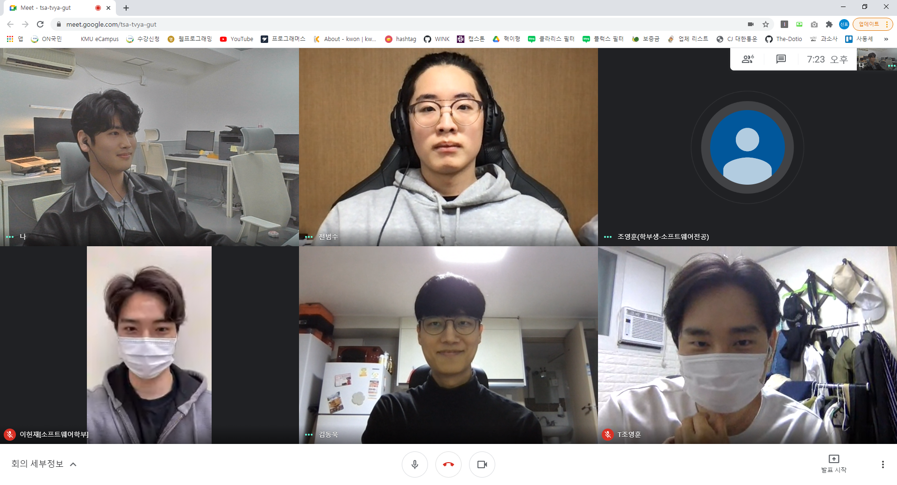
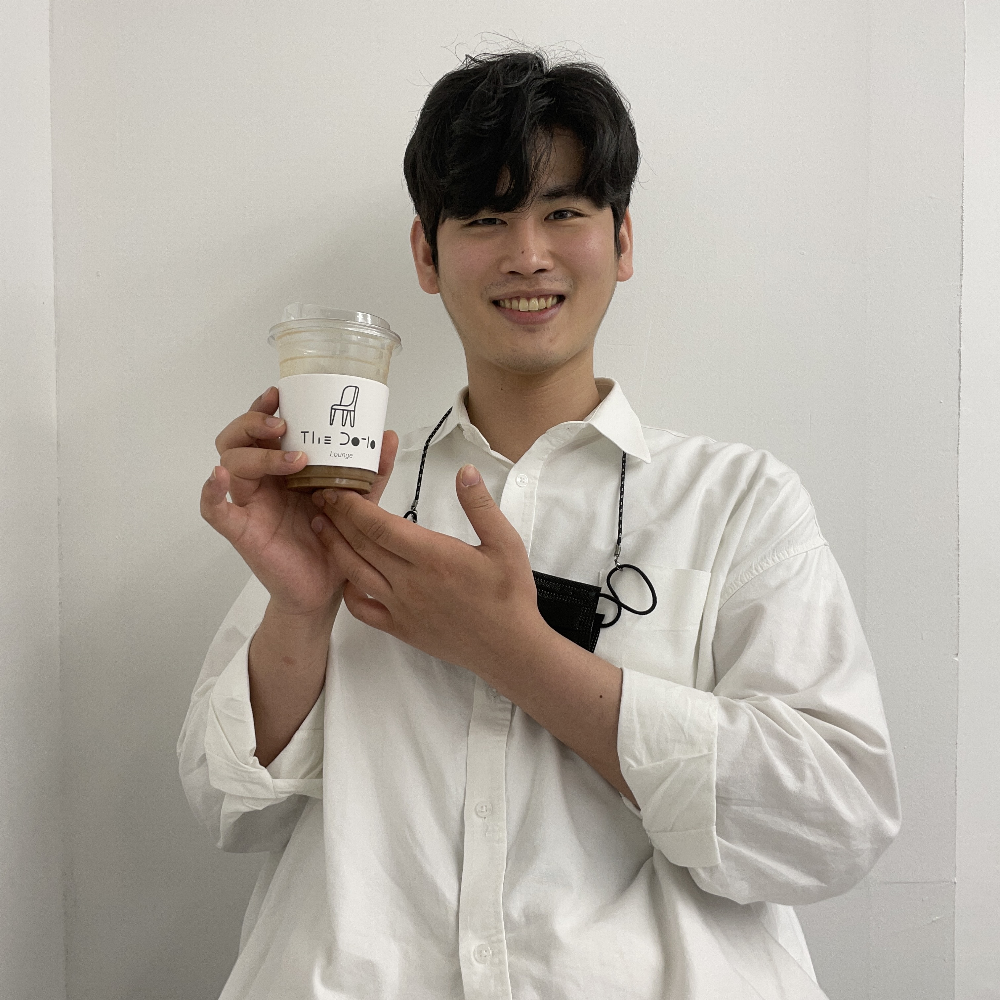
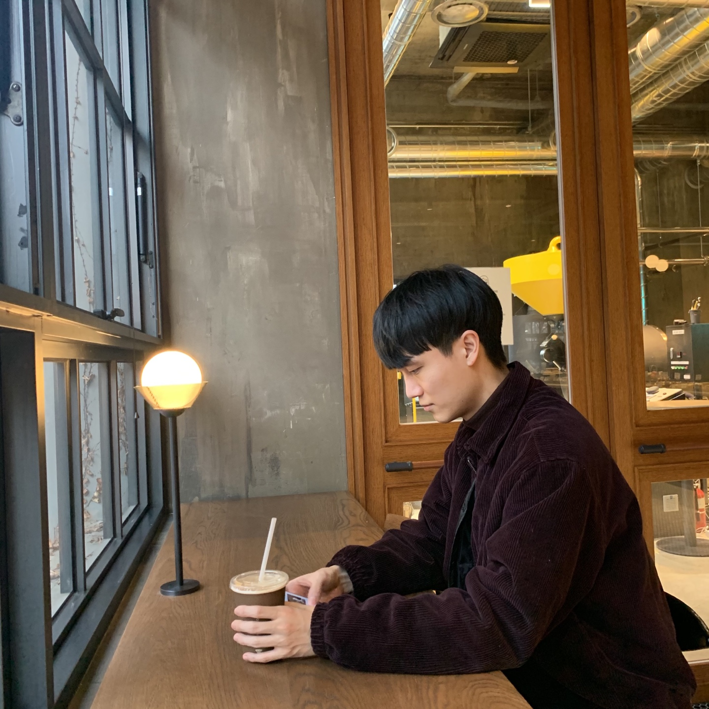
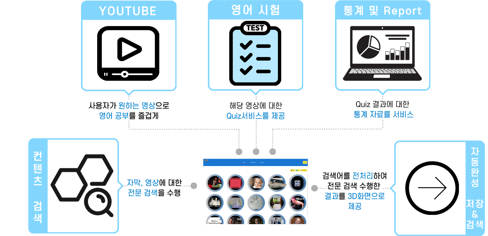
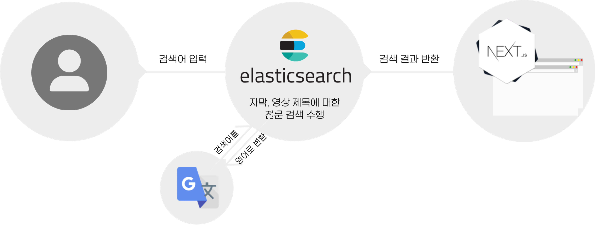
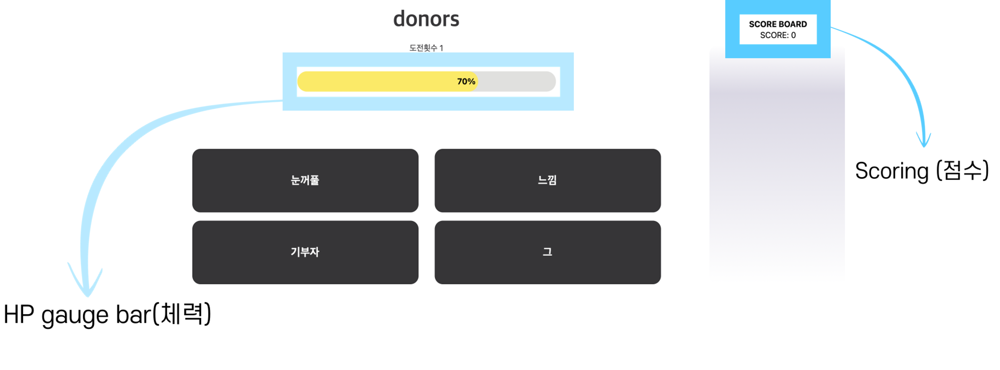
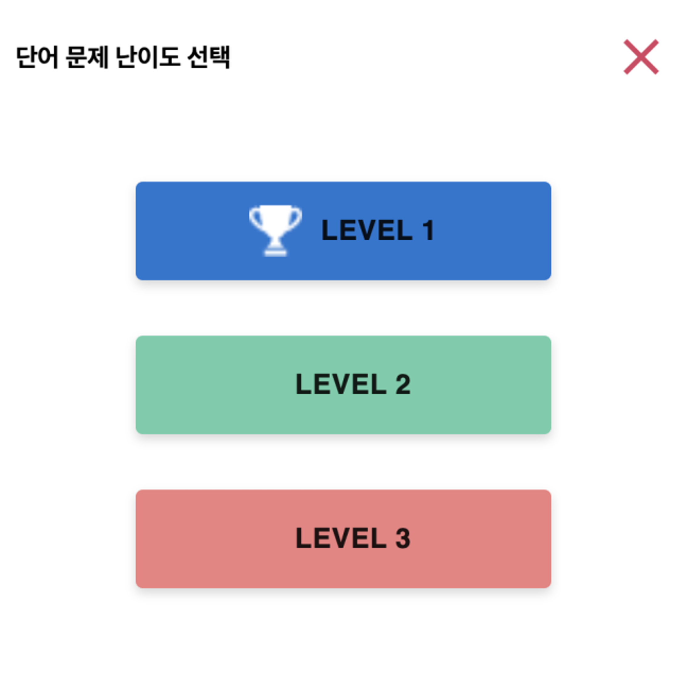
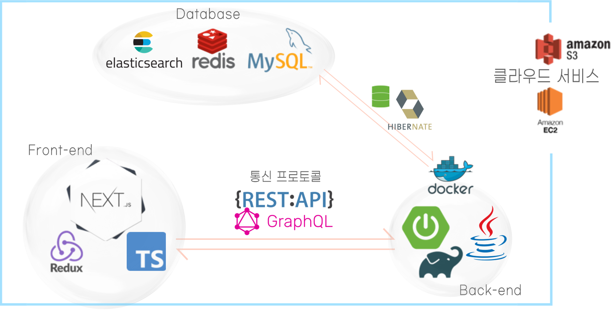
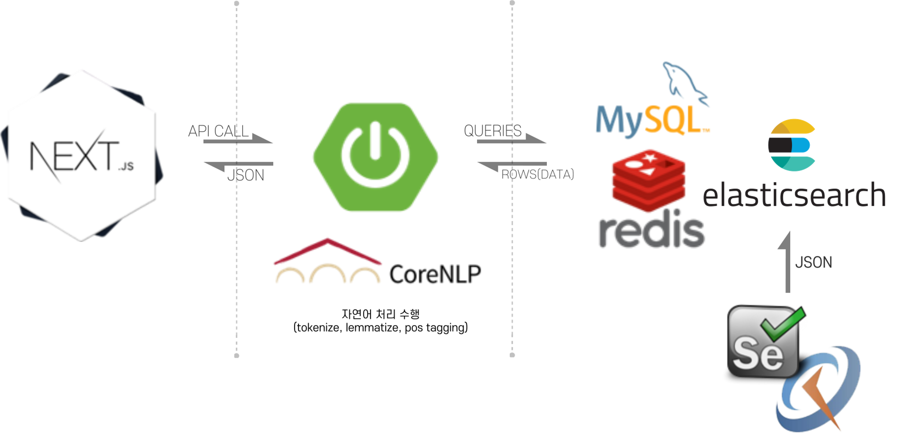
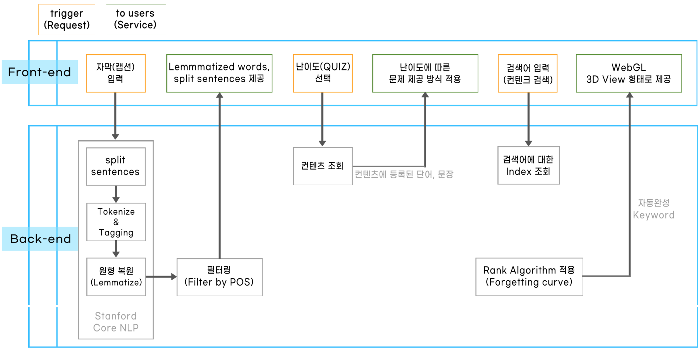

<h2 align="center">HIING</h2>
<p align="center">
  <a href="http://www.hiing.ml/" rel="noopener">
 </a>
</p>

---

**Capstone-2021-2**
{: .text-center}

***🤖 조영훈, 전범수, 이헌재, 김동욱, 강신표 🤖***
{: .text-center}


## 📝 목차
+ [팀 소개](#team)
+ [프로젝트 개요](#overview)
+ [Introduction](#intro)
+ [Tutorial](#tutorial)
+ [사용법](#usage)
+ [핵심 기능](#core_function)
+ [시스템 구성도](#system_diagram)
+ [시스템 설계도](#system_design)
+ [데이터 흐름도](#data_flow)
+ [Authors](#authors)

***

## [💕 Sexy guys of HIING 💕](../introduce-team)<a name = "team"></a>
{: .text-center}

[](http://www.hiing.ml/){: width="50%" .align-center}


## 조영훈 &#128060;
{: .text-center}

{: width="50%" .align-center}
```jsx
학번 : 20153232
Roll : 프로젝트 매니저(PM), 기획/디자인 총괄
#팀장 #뭐라써 #일단 #비워놔줘
``` 
{: .text-center}

***

## 전범수 &#128047;
{: .text-center}
{: width="50%" .align-center} 
```jsx
학번 : 20153223
Roll : 개발 총괄, 웹서비스 구현
#비둘기 #범내려온다
```
{: .text-center}

***

## 강신표 &#128018;
{: .text-center}
{: width="50%" .align-center}
```jsx
학번 : 20163081
Roll : 기획/디자인, GitHub 운영/관리
#전문바리스타🍹 #Comma #thedotio #thedotiolounge
``` 
{: .text-center}

***

## 이헌재 &#128055;
{: .text-center}
{: width="50%" .align-center}
```jsx
학번 : 20163148
Roll : UI/UX 디자인
#잘먹고잘살자 #펭-하
```
{: .text-center}

***

## 김동욱 &#128039;	
{: .text-center}
{: width="50%" .align-center}
```jsx
학번 : 20163090
Roll : 크롤링 서버 구축, Elastic Search DB 구성
#너랑 #나랑 #슬랑 #제4대 #소프트웨어융합대학 #학생회장 #크크큭
```
{: .text-center}

<br>

---

## 🧐 Ⅰ. 프로젝트 개요 <a name = "overview"></a>

### **프로젝트 HIING(하잉)은 원하는 유튜브 영상의 자막 텍스트를 가져와 형태소 분석을 진행해 단어와 문장을 문제의 형태로 만들어 풀 수 있고, 풀었던 문제에 대해 통계 자료도 제공해주는 플랫폼형 웹 서비스입니다.**

<br>

#### **HIING(하잉)의 슬로건**
> #### ***"안전한 비대면으로, 비용이 거의 없이, 좋아하는 컨텐츠로 쉽고 재밌는 영어 학습을 할 수 있게 하자"***
{: .text-center}

<br>

---

## 🎥 Ⅱ. Introduction <a name = "intro"></a>
### 홍보 영상 
{: .text-center}



<br>

### 계획서 영상 
{: .text-center}



<br>

### 최종 발표 영상 
{: .text-center}



<br>

---

## [💭 Ⅲ. Tutorial](../tutorial) <a name = "tutorial"></a>



<br>

---

## 🔍 Ⅳ. 핵심 기능 <a name = "core_function"></a>
{: .align-center}

<br>

> **나만의 컨텐츠 만들기**

{: .align-center}
<br>

> **컨텐츠 풀이(QUIZ) 및 문제 진행 방식**

{: .align-center}


> **QUIZ 결과 통계화 및 서비스**

{: .align-center}

> **컨텐츠 검색**

{: .align-center}

> **자동완성(저장)**

{: .align-center}

> **자동완성(검색)**

{: .align-center}

> **HP gauge bar & Scoring**

문제풀이 결과에 대한 즉각적인 피드백 요소
{: .text-center}

{: .align-center}

> **Reward**

완료한 문제에 대해 리워드(트로피) 부여
{: .text-center}

{: .align-center}

<br>

---

## 🔍 Ⅴ. 시스템 구성도 <a name = "system_diagram"></a>
{: .algin-center}

<br>

---

## 🛠 Ⅵ. 시스템 설계도 <a name = "system_design"></a>
{:. algin-center}

<br>

---

## 🔄 Ⅶ. 데이터 흐름도 <a name = "data_flow"></a>
{: .algin-center}

<br>

---

## ✍️ Authors <a name = "authors"></a>
+ Comma - Initial work
    + [github](https://github.com/sinpyo)
    + [instagram](https://www.instagram.com/kang__comma)
+ Wooki
    + [github](https://github.com/kdwooki)
    + [instagram](https://www.instagram.com/kdwooki)

See also the list of [contributors](https://github.com/kookmin-sw/capstone-2021-2) who participated in this project.

You can also see the other project of [capstone-2021](https://github.com/kookmin-sw)

<br>

***

<br>
<br>
